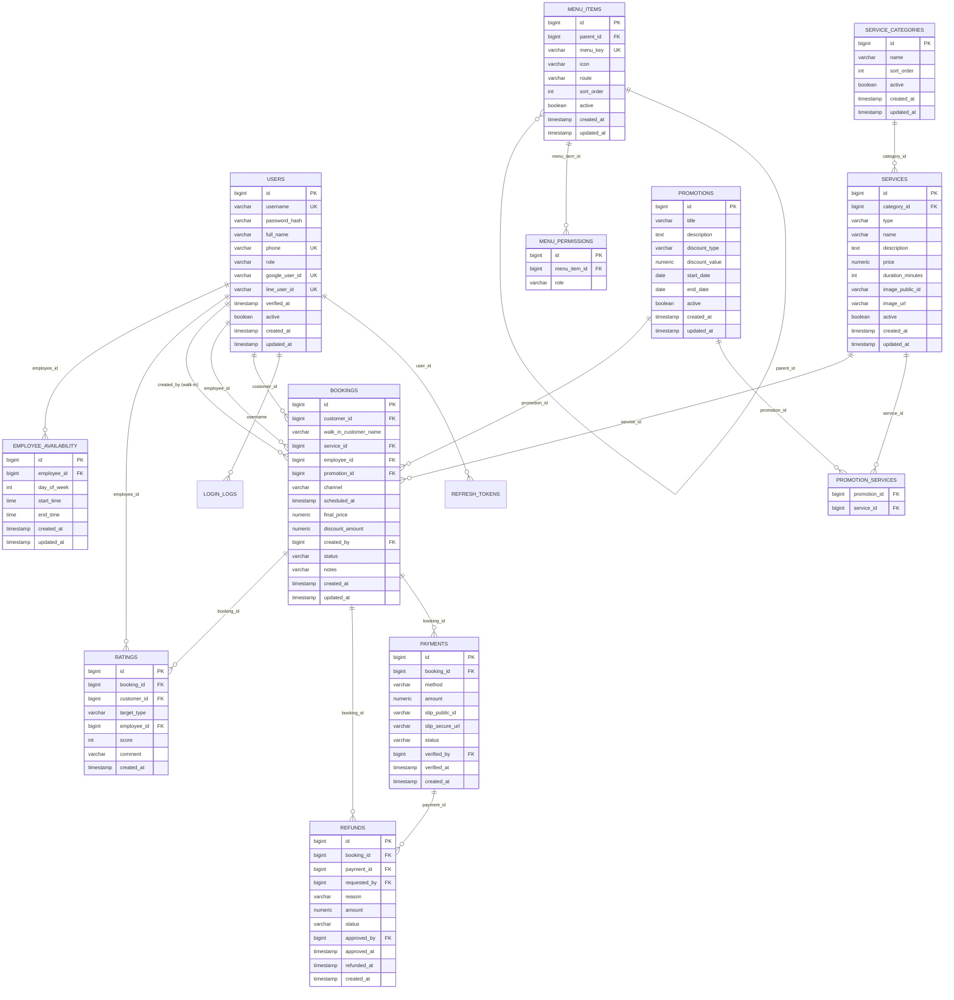

# Database Design — Srinaka (PostgreSQL)

โครงสร้างตารางเต็มสำหรับทั้ง 4 Phase แรก (Phase 5 ไม่มีตารางใหม่ เป็น phase หาบั๊กเท่านั้น) — ดูหัวข้อ
"ทำยังไงให้ดีและเร็วที่สุด" ท้ายไฟล์นี้ว่าจะ implement ตามลำดับ Phase อย่างไรไม่ให้เสียเวลาสร้างของที่ยังไม่ใช้

## 1. ER Diagram

## 2. ตาราง (แยกตาม Phase ที่ใช้)

### Phase 1 — Foundation, Auth, Profile

#### 2.1 `users`

| Column | Type | Constraint | Note |
|---|---|---|---|
| id | BIGINT | PK, identity | |
| username | VARCHAR(50) | UNIQUE, NOT NULL | บังคับกรอกทุกทาง (กรอกเอง/Google/LINE) ให้ login ด้วย username/password ได้เสมอ |
| password_hash | VARCHAR(100) | NOT NULL | BCrypt hash — บังคับกรอกทุกทางเช่นกัน (ดู FR-1.7) |
| full_name | VARCHAR(150) | NOT NULL | |
| phone | VARCHAR(20) | UNIQUE, NULL | ข้อมูลติดต่อธรรมดา บังคับกรอกตอนสมัคร แต่**ไม่ verify ว่าใช้งานได้จริง** (ไม่ใช้ SMS OTP แล้ว) |
| role | VARCHAR(20) | NOT NULL, CHECK IN ('ADMIN','SUPERVISOR','EMPLOYEE','CUSTOMER') | |
| google_user_id | VARCHAR(255) | UNIQUE, NULL | ผูกตอนสมัครผ่าน Google หรือตอนลิงก์บัญชีทีหลัง (FR-1.9) |
| line_user_id | VARCHAR(255) | UNIQUE, NULL | ผูกตอนสมัครผ่าน LINE หรือตอนลิงก์บัญชีทีหลัง (FR-1.9) |
| verified_at | TIMESTAMP | NULL | ต้อง NOT NULL ก่อน Customer จะจองได้ (FR-6.1) — set ทันทีตอนสมัคร/ลิงก์ผ่าน Google หรือ LINE (FR-1.8/FR-1.9), **ไม่เกี่ยวกับเบอร์โทรอีกต่อไป** |
| active | BOOLEAN | NOT NULL DEFAULT TRUE | |
| created_at | TIMESTAMP | NOT NULL DEFAULT now() | |
| updated_at | TIMESTAMP | NOT NULL DEFAULT now() | |

Index: `UNIQUE (lower(username))`, `UNIQUE (phone) WHERE phone IS NOT NULL`, `UNIQUE (google_user_id) WHERE google_user_id IS NOT NULL`, `UNIQUE (line_user_id) WHERE line_user_id IS NOT NULL`, `INDEX (role)`

#### 2.2 `refresh_tokens`

| Column | Type | Constraint | Note |
|---|---|---|---|
| id | BIGINT | PK, identity | |
| user_id | BIGINT | FK → users, NOT NULL | |
| token_hash | VARCHAR(255) | UNIQUE, NOT NULL | |
| expires_at | TIMESTAMP | NOT NULL | |
| revoked | BOOLEAN | NOT NULL DEFAULT FALSE | |
| created_at | TIMESTAMP | NOT NULL DEFAULT now() | |

Index: `INDEX (user_id)`, `UNIQUE (token_hash)`, `INDEX (expires_at)` — เผื่อ job ลบ token หมดอายุ

#### 2.3 `login_logs`

| Column | Type | Constraint | Note |
|---|---|---|---|
| id | BIGINT | PK, identity | |
| username | VARCHAR(50) | NOT NULL | |
| role | VARCHAR(20) | NOT NULL | |
| action | VARCHAR(20) | NOT NULL | LOGIN / LOGOUT |
| created_at | TIMESTAMP | NOT NULL DEFAULT now() | |

Index: `INDEX (username)`, `INDEX (created_at DESC)`

> `otp_verifications` (SMS OTP) ที่เคยออกแบบไว้ตรงนี้ถูกเอาออกแล้ว — เปลี่ยนไปใช้ Google/LINE OAuth link แทน
> (ดู `01-requirements.md` FR-1.7–FR-1.9) ไม่มีตาราง OTP ในระบบอีกต่อไป

#### 2.5 `menu_items` / 2.6 `menu_permissions`

โครงสร้างเดียวกับ Share Money เป๊ะ (ลอกตรง ๆ) — ดู
`share_money_document/docs/03-database-design.md` หัวข้อ 2.11/2.12

Index: `menu_items` → `INDEX (parent_id, sort_order)` / `menu_permissions` → `UNIQUE (menu_item_id, role)`

### Phase 2 — Catalog, Promotion, Booking

#### 2.7 `service_categories`

| Column | Type | Constraint | Note |
|---|---|---|---|
| id | BIGINT | PK, identity | |
| name | VARCHAR(100) | NOT NULL | |
| sort_order | INT | NOT NULL DEFAULT 0 | |
| active | BOOLEAN | NOT NULL DEFAULT TRUE | |
| created_at | TIMESTAMP | NOT NULL DEFAULT now() | |
| updated_at | TIMESTAMP | NOT NULL DEFAULT now() | |

Index: `INDEX (sort_order)`

#### 2.8 `services` (สินค้า+บริการรวมกันในตารางเดียว แยกด้วย `type`)

| Column | Type | Constraint | Note |
|---|---|---|---|
| id | BIGINT | PK, identity | |
| category_id | BIGINT | FK → service_categories, NULL | |
| type | VARCHAR(20) | NOT NULL, CHECK IN ('SERVICE','PRODUCT') | SERVICE มี duration, PRODUCT ไม่มี |
| name | VARCHAR(150) | NOT NULL | |
| description | TEXT | NULL | |
| price | NUMERIC(10,2) | NOT NULL | ห้ามใช้ FLOAT กับเงินเด็ดขาด |
| duration_minutes | INT | NULL | เฉพาะ type=SERVICE |
| image_public_id | VARCHAR(255) | NULL | Cloudinary — public delivery (ไม่ sensitive) |
| image_url | VARCHAR(500) | NULL | |
| active | BOOLEAN | NOT NULL DEFAULT TRUE | |
| created_at | TIMESTAMP | NOT NULL DEFAULT now() | |
| updated_at | TIMESTAMP | NOT NULL DEFAULT now() | |

Index: `INDEX (category_id)`, `INDEX (active)` — public browse query filter ตัวนี้บ่อยที่สุด, `INDEX (type)`

> **ไม่มีคอลัมน์ stock/quantity** — ยืนยันแล้วว่าไม่ต้องตัด stock (ร้านขายบริการเป็นหลัก ไม่ใช่สินค้าที่ต้องนับ
> คงคลัง) ถ้าในอนาคตต้องขายสินค้าจริงจังจนต้องนับสต็อก ค่อยเพิ่มตารางแยกทีหลัง ไม่ใช่ตอนนี้

#### 2.9 `promotions`

| Column | Type | Constraint | Note |
|---|---|---|---|
| id | BIGINT | PK, identity | |
| title | VARCHAR(150) | NOT NULL | |
| description | TEXT | NULL | |
| discount_type | VARCHAR(10) | NOT NULL, CHECK IN ('PERCENT','AMOUNT') | |
| discount_value | NUMERIC(10,2) | NOT NULL | |
| start_date | DATE | NOT NULL | |
| end_date | DATE | NOT NULL | |
| active | BOOLEAN | NOT NULL DEFAULT TRUE | |
| created_at | TIMESTAMP | NOT NULL DEFAULT now() | |
| updated_at | TIMESTAMP | NOT NULL DEFAULT now() | |

Index: `INDEX (active)`, `INDEX (start_date, end_date)` — query "โปรที่ active อยู่ตอนนี้" ใช้ช่วงนี้

#### 2.10 `promotion_services` (join table, many-to-many)

| Column | Type | Constraint | Note |
|---|---|---|---|
| promotion_id | BIGINT | FK → promotions, PK(1/2) | |
| service_id | BIGINT | FK → services, PK(2/2) | |

Index: `PRIMARY KEY (promotion_id, service_id)`, `INDEX (service_id)` — reverse lookup "บริการนี้มีโปรอะไรบ้าง"

#### 2.11 `bookings`

| Column | Type | Constraint | Note |
|---|---|---|---|
| id | BIGINT | PK, identity | |
| customer_id | BIGINT | FK → users, NULL | ต้องเป็น user ที่ role=CUSTOMER และ verified_at ไม่ null (เช็คที่ service layer) — **NULL ได้เฉพาะ channel=WALK_IN** |
| walk_in_customer_name | VARCHAR(100) | NULL | ชื่อลูกค้า walk-in (optional, ไม่บังคับ) — ใช้เฉพาะ channel=WALK_IN |
| service_id | BIGINT | FK → services, NOT NULL | |
| employee_id | BIGINT | FK → users, NULL | ONLINE: assign ทีหลัง (manual). WALK_IN: ระบุทันทีตอนสร้าง (คือคนขาย หรือเลือกคนอื่นก็ได้) |
| promotion_id | BIGINT | FK → promotions, NULL | |
| channel | VARCHAR(20) | NOT NULL DEFAULT 'ONLINE', CHECK IN ('ONLINE','WALK_IN') | ลูกค้าจองเองผ่านเว็บ vs Employee/Supervisor สร้างแทนลูกค้าหน้าร้าน |
| scheduled_at | TIMESTAMP | NOT NULL | วันเวลานัด — WALK_IN ใช้เวลาปัจจุบันตอนสร้าง |
| final_price | NUMERIC(10,2) | NOT NULL | คำนวณจาก service.price − promotion/discount ตอนสร้าง booking (snapshot ไว้ กันราคาเปลี่ยนทีหลังกระทบ booking เก่า) |
| discount_amount | NUMERIC(10,2) | NOT NULL DEFAULT 0 | ส่วนลดที่ Employee คีย์เองตอนขาย walk-in (แยกจากโปรโมชั่น FR-5) — เก็บไว้ audit |
| created_by | BIGINT | FK → users, NULL | Employee/Supervisor ที่สร้างรายการ walk-in แทนลูกค้า — NULL สำหรับ ONLINE (ลูกค้าสร้างเอง) |
| status | VARCHAR(20) | NOT NULL, CHECK IN ('PENDING_PAYMENT','CONFIRMED','COMPLETED','CANCELLED') | WALK_IN ข้าม `PENDING_PAYMENT` ไป `CONFIRMED` ทันทีหลังรับเงินสด |
| notes | VARCHAR(500) | NULL | |
| created_at | TIMESTAMP | NOT NULL DEFAULT now() | |
| updated_at | TIMESTAMP | NOT NULL DEFAULT now() | |

Index: `INDEX (customer_id)`, `INDEX (employee_id, scheduled_at)` — Employee ดูตารางตัวเอง, `INDEX (status)`, `INDEX (scheduled_at)`, `INDEX (channel)`

### Phase 3 — Payment (Slip/Cash), Cancel/Refund, Rating

#### 2.12 `payments`

| Column | Type | Constraint | Note |
|---|---|---|---|
| id | BIGINT | PK, identity | |
| booking_id | BIGINT | FK → bookings, NOT NULL | ไม่ UNIQUE — อนุญาตอัปโหลดสลิปใหม่ได้ถ้าใบแรกถูก reject |
| method | VARCHAR(20) | NOT NULL DEFAULT 'SLIP', CHECK IN ('SLIP','CASH') | CASH ใช้กับ booking channel=WALK_IN เท่านั้น |
| amount | NUMERIC(10,2) | NOT NULL | |
| slip_public_id | VARCHAR(255) | NULL | Cloudinary, `type: authenticated` — **บังคับ NOT NULL เมื่อ method=SLIP เท่านั้น** (เช็คที่ service layer) |
| slip_secure_url | VARCHAR(500) | NULL | ไม่ใช้ตรง ๆ ถ้าเป็น authenticated — generate signed URL สดใหม่ทุกครั้งตาม pattern Share Money |
| status | VARCHAR(20) | NOT NULL, CHECK IN ('PENDING','CONFIRMED','REJECTED') | CASH เข้ามาเป็น `CONFIRMED` ทันที (Employee รับเงินสดต่อหน้า ไม่ต้องมีคนตรวจซ้ำ) |
| verified_by | BIGINT | FK → users, NULL | SLIP: Supervisor/Employee ที่ตรวจ. CASH: คนที่รับเงิน (=created_by ของ booking) |
| verified_at | TIMESTAMP | NULL | |
| created_at | TIMESTAMP | NOT NULL DEFAULT now() | |

Index: `INDEX (booking_id)`, `INDEX (status)`, `INDEX (method)`

#### 2.13 `refunds`

| Column | Type | Constraint | Note |
|---|---|---|---|
| id | BIGINT | PK, identity | |
| booking_id | BIGINT | FK → bookings, NOT NULL | |
| payment_id | BIGINT | FK → payments, NULL | |
| requested_by | BIGINT | FK → users, NOT NULL | Customer ที่ขอยกเลิก |
| reason | VARCHAR(500) | NULL | |
| amount | NUMERIC(10,2) | NOT NULL | |
| status | VARCHAR(20) | NOT NULL, CHECK IN ('REQUESTED','APPROVED','REJECTED','REFUNDED') | |
| approved_by | BIGINT | FK → users, NULL | Supervisor |
| approved_at | TIMESTAMP | NULL | |
| refunded_at | TIMESTAMP | NULL | หลังโอนเงินคืนเองนอกระบบแล้ว mark ตรงนี้ |
| created_at | TIMESTAMP | NOT NULL DEFAULT now() | |

Index: `INDEX (booking_id)`, `INDEX (status)`

#### 2.14 `ratings`

| Column | Type | Constraint | Note |
|---|---|---|---|
| id | BIGINT | PK, identity | |
| booking_id | BIGINT | FK → bookings, NOT NULL | |
| customer_id | BIGINT | FK → users, NOT NULL | |
| target_type | VARCHAR(10) | NOT NULL, CHECK IN ('SHOP','EMPLOYEE') | ตารางเดียวคุมทั้ง 2 แบบ กัน entity/repo ซ้ำซ้อน |
| employee_id | BIGINT | FK → users, NULL | บังคับ NOT NULL เมื่อ target_type=EMPLOYEE (เช็คที่ service layer) |
| score | INT | NOT NULL, CHECK (score BETWEEN 1 AND 5) | |
| comment | VARCHAR(500) | NULL | |
| created_at | TIMESTAMP | NOT NULL DEFAULT now() | |

Index: `UNIQUE (booking_id, target_type)` — จองครั้งนึงให้คะแนนร้าน/พนักงานได้อย่างละ 1 ครั้ง, `INDEX (employee_id)` — คำนวณคะแนนเฉลี่ยพนักงาน, `INDEX (target_type)`

### Phase 4 — Report, Employee Schedule, Admin

#### 2.15 `employee_availability`

| Column | Type | Constraint | Note |
|---|---|---|---|
| id | BIGINT | PK, identity | |
| employee_id | BIGINT | FK → users, NOT NULL | |
| day_of_week | INT | NOT NULL, CHECK (0-6) | 0=อาทิตย์ |
| start_time | TIME | NOT NULL | |
| end_time | TIME | NOT NULL | |
| created_at | TIMESTAMP | NOT NULL DEFAULT now() | |
| updated_at | TIMESTAMP | NOT NULL DEFAULT now() | |

Index: `INDEX (employee_id)`

Report (FR-9) ไม่มีตารางใหม่ — query รวมจาก `bookings`/`payments`/`refunds`/`ratings` ที่มีอยู่แล้ว
(aggregate query ธรรมดา ไม่ต้อง denormalize เพิ่มตอนนี้ ข้อมูลยังน้อย)

#### 2.16 `shop_info` (Phase 2 — FR-11)

| Column | Type | Constraint | Note |
|---|---|---|---|
| id | BIGINT | PK, identity | มีแถวเดียวเสมอ ไม่ใช่ list |
| address | TEXT | NULL | |
| phone | VARCHAR(20) | NULL | |
| email | VARCHAR(150) | NULL | |
| map_url | VARCHAR(500) | NULL | ลิงก์ Google Maps หรือพิกัด |
| business_hours | TEXT | NULL | เก็บเป็น text ธรรมดา (เช่น "จ-ศ 09:00-20:00, ส-อา 10:00-18:00") ไม่ทำ structured schedule เพราะไม่มี requirement เรื่อง auto เปิด-ปิดตามเวลาจริง |
| line_id | VARCHAR(100) | NULL | |
| facebook_url | VARCHAR(500) | NULL | |
| instagram_url | VARCHAR(500) | NULL | |
| updated_at | TIMESTAMP | NOT NULL DEFAULT now() | |

ไม่มี `created_at`/index เพิ่มเติม — ตารางนี้มีแค่แถวเดียวตลอดอายุระบบ (seed แถวแรกไว้ค่าว่างตอน migration
แล้ว Supervisor แก้ทีหลังผ่าน `PUT`, ไม่มี endpoint สร้าง/ลบแถวใหม่)

## 3. ทำยังไงให้ดีและเร็วที่สุด

1. **อย่าสร้างทุกตารางในไฟล์ Flyway เดียวตั้งแต่ Phase 1** — แบ่ง migration ตาม Phase จริงที่กำลัง implement
   (`V1`-`V3` ตอน Phase 1 เอาแค่ users/refresh_tokens/login_logs/menu_items/menu_permissions ตามที่ shipped จริง,
   ค่อยเพิ่ม `V7`+ ตอนเริ่ม Phase 2) — เอกสารนี้ออกแบบล่วงหน้าไว้ครบเพื่อให้เห็นภาพรวม แต่ implement ทีละ Phase
   จริง ๆ กันต้องแก้ schema ที่สร้างไปแล้วถ้า requirement ขยับ (มี assumption ที่ยังไม่ confirm หลายจุดตาม
   `01-requirements.md`)
2. **ลอก pattern จาก Share Money ตรง ๆ ไม่ต้องคิดใหม่**: `BaseEntity` (created_at/updated_at ผ่าน JPA
   Auditing), `IDENTITY` generation strategy, `FileStorageService`/Cloudinary abstraction สำหรับทั้งรูป
   สินค้า/บริการ (public) และสลิป (authenticated + signed URL)
3. **ห้าม hardcode id ใน seed migration** (บทเรียนจาก Share Money ที่เจอ `menu_items` ชน id ที่ auto-generate
   ไปแล้ว) — insert โดยไม่ระบุ id แล้ว subquery หา id กลับมาใช้เสมอ
4. **เงินใช้ `NUMERIC(10,2)` เท่านั้น ห้าม FLOAT/DOUBLE** กันปัญหาปัดเศษ
5. **ป้องกัน N+1 เหมือนกติกา Share Money**: query list booking ที่ join customer/service/employee ต้องใช้
   `JOIN FETCH`/`@EntityGraph`
6. **Index เท่าที่ query จริงต้องใช้** — ทุก FK ที่จะ join/filter บ่อย (ดู "Index:" ท้ายแต่ละตารางด้านบน) ไม่ต้อง
   เพิ่ม index เกินความจำเป็นตอนข้อมูลยังน้อย (personal/small-business scale) ค่อยเพิ่มทีหลังถ้าพบ query ช้าจริง
